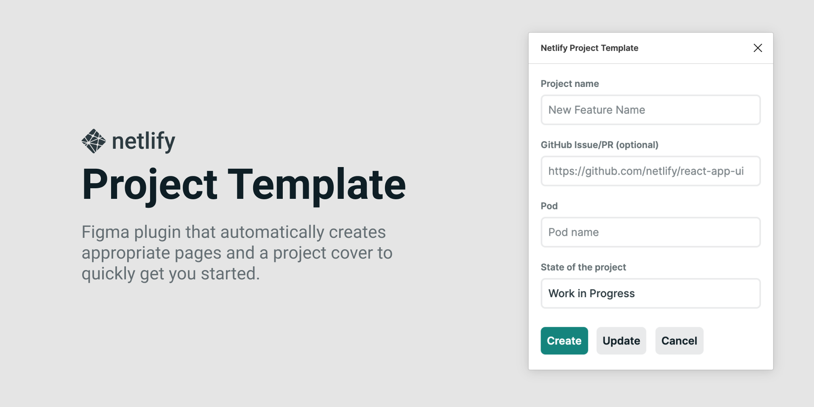

# Netlify Project Template: Figma Plugin

## How to use

1. In the menu bar, go to `Plugins → Netlify Project Template`.
2. [Type in the name of the project, project URL, and select the state of development](/screenshots/screenshot-5.png?raw=true). Hit `Create`.
3. `Create` will create all the necessary pages and titles, remember that if you run that command on an existing file it will keep all the existing pages as well. 
4. Alternatively, and if you'd like to just update the cover page, hit the `Update` button instead, and this will take the state of development dropdown and update the cover with any new information.

## How to install

At the moment, this plugin is definitely not ready for prime time and to be published in the public Figma Plugin directory, but it is enabled for everyone within our Netlify Figma org, so no manual setup neccessary!

## Help

I'm sure this is buggy as The Bug's Life, if you find one, please open an issue here on this repo and [ping the design team on Slack](https://netlify.slack.com/archives/C015DJ64XPH). Thank you! 🙏
